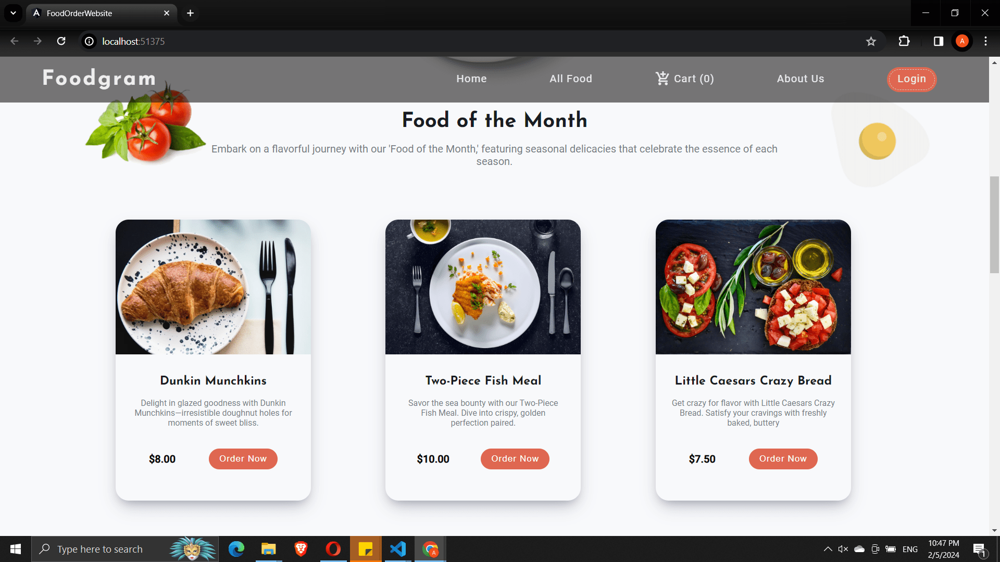
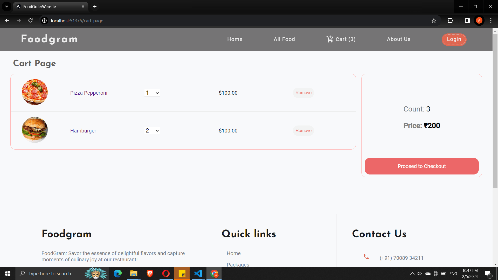

# Foodgram

Foodgram is a modern web application tailored for a specific restaurant, offering an engaging and visually appealing user interface. The application allows users to explore the restaurant's menu, filter through various food items, add them to their cart, and make payments seamlessly through PayPal.

<a href="https://ankit4b.github.io/Foodgram-Angular/">Click here to explore the UI of the Foodgram application.</a>

## Features

- User Registration
- User Login
- Display and Filter Foods
- Add to Cart
- Payment with PayPal Integration

## Technologies Used

- Angular
- MongoDB
- Node.js
- Express.js

### Home Page Preview

### Search and Filter Preview

### Cart

### PayPal payment

